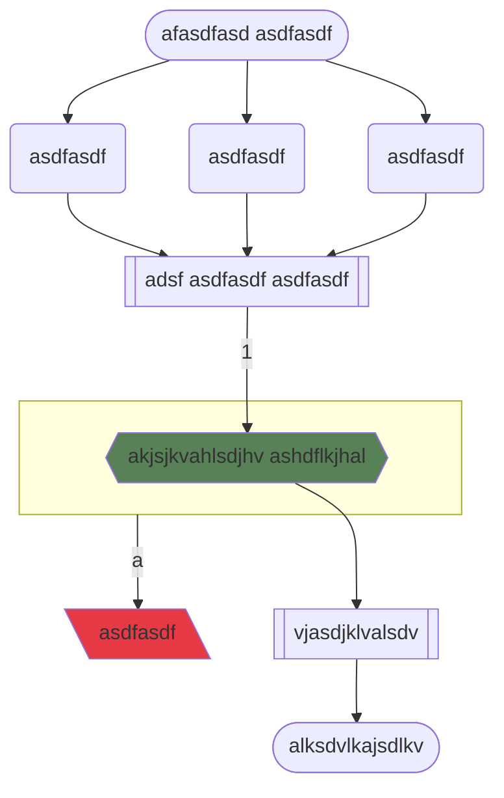

# parkour

`tre`

### Use case

|         Purposes | afasdfasd asdfasdf          |
| ---------------: | --------------------------- |
|           Actors | asdfasdf,asdfasdf,asdfasdf  |
|    Pre condition | adsf asdfasdf asdfasdf      |
| Success scenario |                             |
|               1. | akjsjkvahlsdjhv ashdflkjhal |
|   Post condition | vjasdjklvalsdv              |
|             Goal | alksdvlkajsdlkv             |
|       Extensions |                             |
|              \*a | asdfasdf                    |

### Diagram

### Note

> Add something
