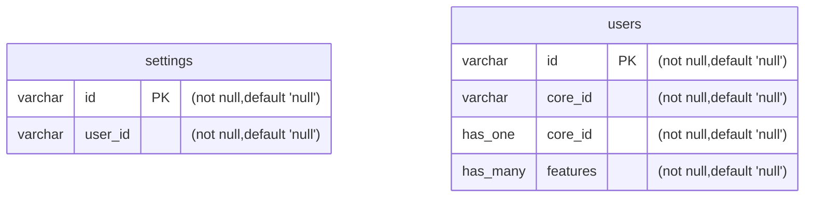

# mysql

> Update tags here `infra` `marketing`

### Reason to use

> Add something

### Entities

- [users](./users.entity.md)
- [settings](./settings.entity.md)

### ERD

```mermaid
erDiagram
settings {
varchar id PK "(not null,default 'null')"
varchar user_id "(not null,default 'null')"
}
users {
varchar id PK "(not null,default 'null')"
varchar core_id "(not null,default 'null')"
has_one core_id "(not null,default 'null')"
has_many features "(not null,default 'null')"

}
```
