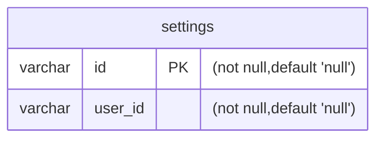

# settings

`infra` `marketing`

| Name    | Type                      | PK  | FK  | Nullable | Default |
| ------- | ------------------------- | --- | --- | -------- | ------- |
| id      | varchar                   | [x] |     | FALSE    | null    |
| user_id | varchar, belongs to users |     | [x] | FALSE    | null    |

### Diagram

### Note

> Add something
