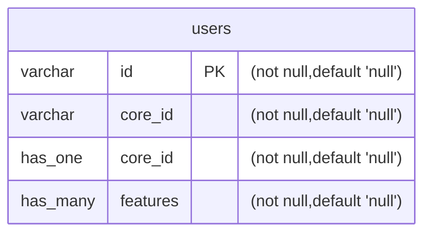

# users

> Update tags here `infra` `marketing`

| Name     | Type     | PK  | FK  | Nullable | Default |
| -------- | -------- | --- | --- | -------- | ------- |
| id       | varchar  | [x] |     | FALSE    | null    |
| core_id  | varchar  |     | [x] | FALSE    | null    |
| core_id  | has_one  |     | [x] | FALSE    | null    |
| features | has_many |     | [x] | FALSE    | null    |
|          | has_many |     | [x] | FALSE    | null    |

### Diagram

### Note

> Add something
