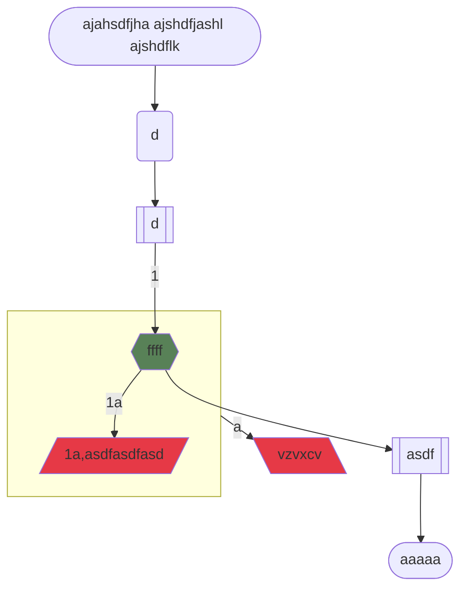

# some-uc

> Update tags here `infra` `marketing`

### Use case

|         Purposes | ajahsdfjha ajshdfjashl ajshdflk |
| ---------------: | ------------------------------- |
|           Actors | d                               |
|    Pre condition | d                               |
| Success scenario |                                 |
|               1. | ffff                            |
|   Post condition | asdf                            |
|             Goal | aaaaa                           |
|       Extensions |                                 |
|              \*a | vzvxcv                          |
|               1a | asdfasdfasd                     |

### Diagram

### Note

> Add something
