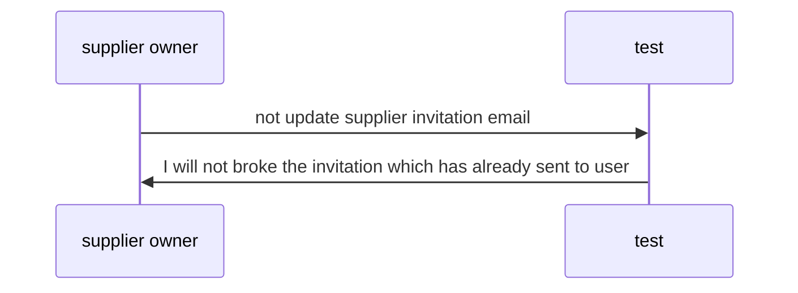

# some-us

> Update tags here `infra` `marketing`

### User story

```txt
As a supplier owner
I want not update supplier invitation email
so that I will not broke the invitation which has already sent to user
```

### Diagram



### Note

> Add something
